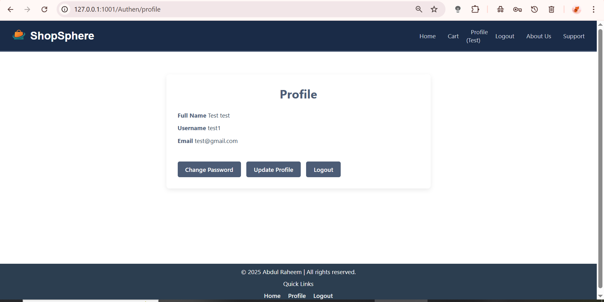

# ShopSphere - Django E-commerce Project

# ShopSphere

ShopSphere is a full-featured e-commerce web application built with Django. It provides a user-friendly platform for customers to browse products, add items to cart. This project showcases skills in Django development, user authentication, database management, and front-end design.

---

## Features

- User registration, login, and profile management
- Product catalog with categories and search functionality
- Shopping cart with add, update, and remove item features
- Admin panel for managing products, orders, and users

---

## Technologies Used

- Django (Backend framework)
- Python
- HTML, CSS (Frontend)
- SQLite (default DB, can be switched to others)
- Git & GitHub (Version control)

---

## Usage 

Register a new user account or login with existing credentials.

Browse products and add desired items to your cart.

Proceed to checkout to place your order.

---

## 🚀 Future Development

We plan to continue improving ShopSphere with the following features:

🛒 Shopping Cart Enhancements:

Persistent cart (save cart across sessions)

Real-time item availability updates

💳 Payment Integration:

Integration with Razorpay, Stripe, or PayPal

Invoice generation and order summary via email

🔒 Security & Authentication:

Two-factor authentication

Password reset via email

📦 Order Management:

Order tracking system

Delivery status updates for users and admins

🧠 Admin Dashboard:

Visual analytics for sales and users

Inventory management system

💬 Customer Engagement:

Product reviews and ratings

Live chat support and contact form

🌐 SEO & Performance:

SEO-friendly URLs and meta tags

Caching for faster loading

📱 Responsive Improvements:

Enhanced mobile-first design

PWA (Progressive Web App) support

🎨 Theme Customization:

Multiple UI themes for users

Dark mode support


---

## Contributing 

Contributions are welcome! Feel free to open issues or submit pull requests for bug fixes and new features.

---

## License 

This project is licensed under the MIT License.

---

## Contact 

Created by Abdul Raheem - LinkedIn | Email: abdulraheem.asangi@gmail.com

---

## Installation

1. Clone the repository:

   ```bash
   git clone https://github.com/abdulraheemasangi/ShopSphere-Ecommerce.git

2. Navigate to the project directory:

   ```bash
   cd ShopSphere-Ecommerce

3. Create and activate a virtual environment:

   ```bash
   python -m venv myenv
    source myenv/bin/activate  # On Windows: myenv\Scripts\activate


4. Install required packages:

   ```bash
   pip install -r requirements.txt

5. Apply migrations:

   ```bash
   python manage.py migrate

6. Create a superuser (optional, for admin access):

   ```bash
   python manage.py createsuperuser

7. Run the development server:

   ```bash
   python manage.py runserver

8. Open your browser and visit :

    http://127.0.0.1:8000/

## Screenshots

### Homepage


### Details Page


### Cart Page


### Offers Page


### Trending Page


### Profile Page


### Login Page


### Register Page

